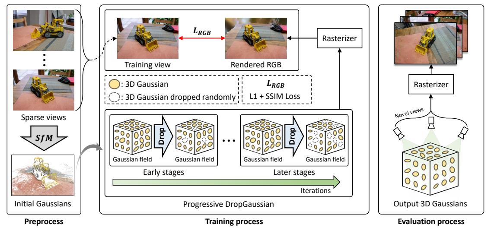

<h1 align="center">DropGaussian:Structural Regularization<br>for Sparse-view Gaussian Splatting</h1>


Official Pytorch implementation [**"DropGaussian: Structural Regularization for Sparse-view Gaussian Splatting"**](https://arxiv.org/abs/2304.09502v1) <br>
[Hyunwoo Park](https://github.com/HWP97?tab=repositories), [Gun Ryu](https://github.com/jerry-ryu), and [Wonjun Kim](https://sites.google.com/view/dcvl/team/professor) (Corresponding Author) <br>
🎸***IEEE/CVF International Conference on Computer Vision and Pattern Recognition (CVPR)***, Jun. 2025.🎸

<p align="center"></p>
<p align="center">[ Training pipeline ]</p>

## :eyes: Overview 
We propose a simple yet powerful regularization technique, **DropGaussian**, for neural rendering with sparse input views.

By randomly eliminating Gaussians during the training process, DropGaussian gives the opportunity for the remaining Gaussians to be more visible with larger gradients, which make them to meaningfully contribute to the optimization process of 3DGS.
This is fairly desirable to alleviate the overfitting problem occurring in sparse-view conditions.

We provide:

- ✅ **Full implementation** of DropGaussian
- ⚡ **Minimal plug-and-play code snippet** for quick integration

## 🚀 Quick Snippet

Here's a minimal example of how to use `DropGaussian` in your training loop:

```python
import torch
# (Assume the rest of the 3DGS pipeline is already set up)
# Create initial compensation factor (1 for each Gaussian)
compensation = torch.ones(opacity.shape[0], dtype=torch.float32, device="cuda")

# Apply DropGaussian with compensation
drop_rate = 0.1
d = torch.nn.Dropout(p=drop_rate)
compensation = d(compensation)

# Apply to opacity
opacity = opacity * compensation[:, None]
```
## ✅ Full implementation
### Installation
We provide an installation using Conda package and environment management:
```
git clone https://github.com/DCVL-3D/DropGaussian_release
cd DropGaussian_release
conda env create --file environment.yaml
conda activate DropGaussian
```

**Note:** This Conda environment assumes that **CUDA 12.1** is already installed on your system.

### Data Preparation

In the data preparation stage, we first reconstruct sparse-view inputs using **Structure-from-Motion (SfM)** with the provided camera poses from the datasets. Then, we perform dense stereo matching using COLMAP’s `patch_match_stereo` function, followed by `stereo_fusion` to generate the dense stereo point cloud.

<details>
<summary><strong> Setup Instructions</strong></summary>

```bash
cd FSGS
mkdir dataset
cd dataset

# Download LLFF dataset
gdown 16VnMcF1KJYxN9QId6TClMsZRahHNMW5g

# Generate sparse point cloud using COLMAP (limited views)
python tools/colmap_llff.py

# Download MipNeRF-360 dataset
wget http://storage.googleapis.com/gresearch/refraw360/360_v2.zip
unzip -d mipnerf360 360_v2.zip

# Run COLMAP for MipNeRF-360
python tools/colmap_360.py
```

We also provide preprocessed sparse and dense point clouds for convenience.
You can download them via the link below:

👉 [Download Preprocessed Point Clouds](https://drive.google.com/drive/folders/1P3I9m_HU0jF50qwxIIhXhegOVk-kihdI?usp=sharing)
</details>

### Training

_This section will be released soon!_
### Rendering

_This section will be released soon!_
### Evaluation

_This section will be released soon!_

## License

This research code is released under the MIT license. Please see [LICENSE](LICENSE) for more information.

## Acknowledgments
This work was supported by the National Research Foundation of Korea (NRF) grant funded by the Korea government (MSIT) (RS-2023-NR076462) and Institute of Information Communications Technology Planning Evaluation (IITP) grant funded by the Korea government (MSIT) (No. 2018-0-00207, RS-2018-II180207, Immersive Media Research Laboratory).

Our implementation and experiments are built on top of open-source GitHub repositories. We thank all the authors who made their code public, which tremendously accelerates our project progress. If you find these works helpful, please consider citing them as well.

[GraphDeco-INRIA/gaussian-splatting](https://github.com/graphdeco-inria/gaussian-splatting)  </br>
[VITA-Group/FSGS](https://github.com/VITA-Group/FSGS)  </br>
